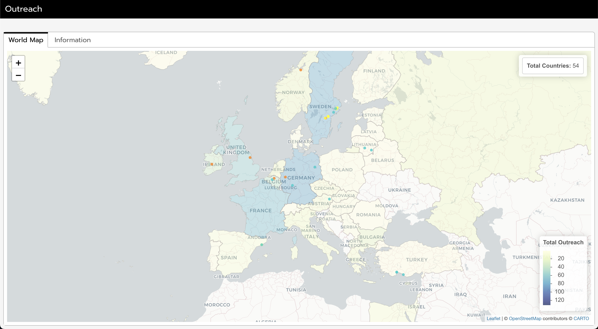

# Overview

This dashboard demonstrates how a global creative outreach and an individual artistic journey can be visualized, integrating multiple dimensions of activity and impact:

* number of albums released via the labels Nova Beat Estate (2006–2012) and [Motivational Music](https://www.motivational-music.one) (since 2024) by country;
* number of international collaborations, including albums and podcasts, since 2005;
* compilation tracks received from contributors, both solo tracks and parts in international collaborative tracks, since 2020;
* geolocated points with detailed artist cards (orange points), showcasing collaborators or peers who opted to be included, enabling discovery and support on their own terms;
* documented visits to specific cities since 2020 (yellow points for photos, cyan points for field recordings), offering a personal layer to the outreach story.

The dashboard aggregates the first three metrics into a global **outreach score** while visualizing the interplay between geographic outreach, artistic connections, and travel history. It uncovers patterns, such as clustering of outreach and artistic activity, and contextualizes them in a geographic and experiential framework. Additionally, sentiment analysis of the [Concepts and Creations](https://paragraph.xyz/@aurora-mm) blog posts provides an emotional perspective on this creative journey. By quantifying sentiment, the dashboard reveals an overwhelmingly positive and inspiring outlook, reinforcing the value of these creative efforts.

This project began as a mental health initiative to address the question, *“Did anything I do creatively matter?”* It has since evolved into a tool for exploring the tangible and intangible impacts of creative work:

* the dashboard places artists on maps, helping them to be discovered and supported on their own terms;
* it highlights cities’ roles in artistic networks, providing an experiential angle by allowing field recordings and photos to immerse viewers in these places. This approach draws inspiration from projects like [Cities and Memory](https://citiesandmemory.com) but operates on a small, highly personal scale;
* it offers hope and inspiration, demonstrating that it’s possible to make a significant global impact even from a small flat in Eastern Sweden, without factoring in solo albums.

As an open-source project, this dashboard is not just a personal narrative but a template for others to visualize their own creative journeys. Its design allows for easy adaptation to measure and map activities, connections and travels, enabling anyone to tell their story in an engaging and meaningful way.

# Repository Structure

`index.html`: The main HTML file for the dashboard.

`outreach.Rmd`: The source [R Markdown](https://rmarkdown.rstudio.com) document.

`database.xlsx`: The dataset for the dashboard.

`scripts/`: Contains scripts (Python and R) for dashboard maintenance and sentiment analysis.

# Dependencies

`flexdashboard`, `leaflet`, `sf`, `tidyverse`, `geodata`, `RColorBrewer` (R, dashboard)

`tidyverse`, `tidytext`, `tm`, `wordcloud`, `SnowballC`, `textdata`, `udpipe` (R, script)

`os`, `re`, `requests`, `json`, `bs4` (Python, scripts)

# Usage

Open `outreach.Rmd` in [RStudio](https://posit.co/products/open-source/rstudio) and knit it to generate the dashboard, or directly open `index.html` in a web browser to view the pre-generated dashboard.

## Customization

* modify `database.xlsx` and `outreach.Rmd` to include your own creative metrics, such as collaborations, albums, or travel records;
* use the scripts in the `scripts/` folder to perform dashboard maintenance and sentiment analysis.

For detailed instructions on how to add field recordings and photos to the dashboard, refer to the README file in the `scripts/` folder.

# Author

Linn Friberg
