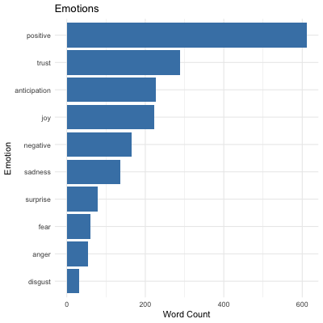
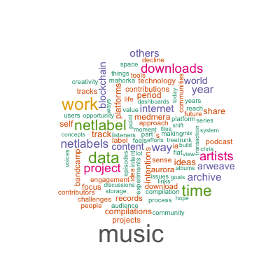

```{r setup, include=FALSE}
library(flexdashboard)
library(leaflet)
library(sf)
library(tidyverse)
library(geodata)
library(RColorBrewer)

thematic::thematic_rmd()

# Function for processing the compilations sheet
compilationsProcess <- function(df) {
  dfOut <- rbind(
    cbind(df$artist1, df$country1),
    cbind(df$artist2, df$country2),
    cbind(df$artist3, df$country3),
    cbind(df$artist4, df$country4),
    cbind(df$artist5, df$country5),
    cbind(df$artist6, df$country6),
    cbind(df$artist7, df$country7)
  ) %>%
    na.omit() %>%
    as.data.frame()
  colnames(dfOut) <- c("artist", "country")
  dfOut <- table(dfOut$country) %>% as.data.frame()
  return(dfOut)
}

# Function for loading count data
loadCountData <- function(filename, sheet, geometry, isComp = FALSE) {
  dfOut <- readxl::read_excel(path = filename, sheet = sheet)
  if (isComp == FALSE) {
    dfOut <- table(dfOut$country) %>% as.data.frame()
  } else {
    dfOut <- compilationsProcess(dfOut)
  }
  colnames(dfOut) <- c("country", "count")
  return(dfOut)
}

# Function for loading spatial data
loadSpatData <- function(filename, sheet, crs = 4269) {
  dfOut <- readxl::read_excel(path = filename, sheet = sheet) %>% tidyr::drop_na()
  dfOut <- sf::st_as_sf(dfOut,
    coords = c("longitude", "latitude"),
    crs = crs
  ) %>% sf::st_transform("+proj=longlat +datum=WGS84")
  return(dfOut)
}
```

Column {data-width=650 .tabset}
-----------------------------------------------------------------------

### World Map

```{r}
# Load the geometry
Outreach <- geodata::world(path = tempdir())
Outreach <- sf::st_as_sf(Outreach)
Outreach <- Outreach %>% select(NAME_0, geometry)
colnames(Outreach) <- c("country", "geometry")

# Load count data (Collaborations, Label, Compilations)
Collaborations <- loadCountData("database.xlsx", "Collaborations", Outreach)
Label <- loadCountData("database.xlsx", "Label", Outreach)
Compilations <- loadCountData("database.xlsx", "Compilations", Outreach, isComp = TRUE)

# Calculate solo album count
SoloAlbums <- nrow(readxl::read_excel(path = "database.xlsx", sheet = "Solo"))

# Produce totals
Totals <- Collaborations %>%
  rename(collab_count = count) %>%
  full_join(Label %>% rename(label_count = count), by = "country") %>%
  full_join(Compilations %>% rename(comp_count = count), by = "country") %>%
  mutate(
    label_count = coalesce(label_count, 0),
    comp_count = coalesce(comp_count, 0),
    collab_count = coalesce(collab_count, 0),
    total_count = label_count + comp_count + collab_count
  )

# Add geometry to totals
Totals <- Outreach %>%
  inner_join(Totals, by = "country")

# Load spatial data (Travel, Artists, Photos)
Travel <- loadSpatData("database.xlsx", "Travel")
Artists <- loadSpatData("database.xlsx", "Artists")
Photos <- loadSpatData("database.xlsx", "Photos")

# Create the leaflet map
leaflet() %>%
  addProviderTiles(providers$CartoDB.Positron) %>%
  setView(lng = 10, lat = 50, zoom = 4) %>%
  # Add shaded polygons for the totals
  addPolygons(
    data = Totals,
    fillColor = ~ colorNumeric("YlGnBu", total_count)(total_count),
    fillOpacity = 0.3, color = "darkgrey", weight = 1, stroke = TRUE,
    popup = ~ paste0(
      "<strong>Country:</strong> ", country,
      "<br><strong>Label Releases:</strong> ", label_count,
      "<br><strong>Collaborations:</strong> ", collab_count,
      "<br><strong>Compilation Contributions:</strong> ", comp_count
    )
  ) %>%
  
  # Add legend
  addLegend(
    position = "bottomright",
    pal = colorNumeric("YlGnBu", Totals$total_count),
    values = Totals$total_count,
    title = "Total Outreach",
    opacity = 0.7
  ) %>%
  
  addControl(
    html = paste0(
      "<div style='padding: 10px; background: white; border: 1px solid #ccc; border-radius: 4px;'>",
      "<strong>Total Countries:</strong> ", nrow(Totals),
      "</div>"
    ),
    position = "topright"
  ) %>%
  
  # Add layers for Artists
  addCircleMarkers(
    data = Artists,
    radius = 3, color = "#FF8000", stroke = TRUE, weight = 1, fillOpacity = 0.8,
    popup = ~ paste0("")
  ) %>%
  
  # Add layers for Photos
  addCircleMarkers(
    data = Photos,
    radius = 3, color = "#FFFF00", stroke = TRUE, weight = 1, fillOpacity = 0.8,
    popup = ~ paste0("<iframe src='", url, "' style='width:255px;height:438px;'></iframe>")
  ) %>%
  
  # Add layers for Travel
  addCircleMarkers(
    data = Travel,
    radius = 3, color = "#00CCCC", stroke = TRUE, weight = 1, fillOpacity = 0.8,
    popup = ~ paste0("<iframe src='", url, "' style='height:30px;' allow='autoplay'></iframe>")
  )
```

### Information

<script>
function showSentimentPopup() {
  const popupContent = `
    <div style="max-width:600px; text-align:center;">
      <h4>Sentiment Analysis</h4>
      
      
    </div>`;
  const popupWindow = window.open("", "SentimentAnalysis", "width=600,height=800");
  popupWindow.document.write(popupContent);
  popupWindow.document.close();
}
</script>

This dashboard demonstrates how a global creative outreach and an individual artistic journey can be visualized, integrating multiple dimensions of activity and impact:

* number of albums released via the labels **Nova Beat Estate** (2006–2012) and [Motivational Music](https://www.motivational-music.one) (since 2024) by country;
* number of international collaborations, including albums and podcasts, since 2005;
* compilation tracks received from contributors, both solo tracks and parts in international collaborative tracks, since 2020; 
* geolocated points with detailed artist cards (orange points), showcasing collaborators or peers who opted to be included, enabling discovery and support on their own terms;
* documented visits to specific cities since 2020 (yellow points for photos, cyan points for field recordings), offering a personal layer to the outreach story.

The dashboard aggregates the first three metrics into a global **outreach score** while visualizing the interplay between geographic outreach, artistic connections, and travel history. It uncovers patterns, such as clustering of outreach and artistic activity, and contextualizes them in a geographic and experiential framework. Additionally, <span style="color:blue; text-decoration:underline; cursor:pointer;" onclick="showSentimentPopup()">sentiment analysis</span> of the [Concepts and Creations](https://paragraph.xyz/@aurora-mm) blog posts provides an emotional perspective on this creative journey. By quantifying sentiment, the dashboard reveals an overwhelmingly positive and inspiring outlook, reinforcing the value of these creative efforts.

This project began as a mental health initiative to address the question, *"Did anything I do creatively matter?"* It has since evolved into a tool for exploring the tangible and intangible impacts of creative work:

* the dashboard places artists on maps, helping them to be discovered and supported on their own terms;
* it highlights cities' roles in artistic networks, providing an experiential angle by allowing field recordings and photos to immerse viewers in these places. This approach draws inspiration from projects like [Cities and Memory](https://citiesandmemory.com) but operates on a small, highly personal scale;
* it offers hope and inspiration, demonstrating that it’s possible to make a significant global impact even from a small flat in Eastern Sweden, without factoring in solo albums (currently `r SoloAlbums`, since 2019).

As an [open-source](https://github.com/aurora-mm/Outreach) project, this dashboard is not just a personal narrative but a template for others to visualize their own creative journeys. Its design allows for easy adaptation to measure and map activities, connections and travels, enabling anyone to tell their story in an engaging and meaningful way.

